# 🌌 Toolverse - AI 工具宇宙

<div align="center">


**探索、分析、评估 AI 工具生态系统的开源知识库**

[](CONTRIBUTING.md)
[](https://www.python.org/downloads/release/python-3100/)
[](LICENSE)
[](https://GitHub.com/Icarus603/toolverse/graphs/commit-activity)
[](https://github.com/Icarus603/toolverse/stargazers)
[](https://github.com/Icarus603/toolverse/network/members)
[](https://github.com/Icarus603/toolverse/issues)
[](CONTRIBUTING.md)
[](https://www.python.org/)
[](https://github.com/Icarus603/toolverse/tree/main/docs)

</div>

## 📑 目录

- [项目简介](#-项目简介)
- [功能模块概览](#-功能模块概览)
- [最新收录工具](#-最新收录工具)
- [数据源与爬虫](#-数据源与爬虫)
- [快速开始](#-快速开始)
- [环境配置](#️-环境配置)
- [自动更新流程](#-自动更新流程)
- [项目目录结构](#-项目目录结构)
- [项目路线图](#️-项目路线图)
- [未来展望](#-未来展望)
- [如何参与贡献](#-如何参与贡献)
- [贡献者](#-贡献者)
- [特别致谢](#-特别致谢)
- [许可证](#-许可证)

---

## 🌟 项目简介

**Toolverse** 是一个集成了 🧠 **人工整理**、🤖 **自动采集** 与 🧪 **工具评测** 的开源 AI 工具知识库项目，致力于构建结构化、可追踪、可演化的 **AI 工具地图** 🗺️，服务广大开发者、研究者与数字创造者。

<div align="center">
    
</div>

---

## 🚀 功能模块概览

<div align="center">

| 模块        | 功能描述                           |
| ----------- | ---------------------------------- |
| 🧾 工具索引 | 用 YAML 管理所有工具元信息         |
| 🔍 自动爬虫 | 定期抓取 FutureTools 等热门站点    |
| 🔄 数据更新 | 自动去重、合并，并更新主索引与展示 |
| 📊 趋势分析 | 基于数据分析工具生态结构和发展趋势 |

</div>

---

## 🧪 最新收录工具

<div align="center">

<!--LATEST_TOOLS_START-->

这里将自动插入最新工具表格……

<!--LATEST_TOOLS_END-->

</div>

---

## 📊 数据源与爬虫

<div align="center">
    
</div>

我们致力于从多样化的平台收集最新的 AI 工具信息，主要包括：

<details open>
<summary><b>📌 数据源平台详情</b></summary>

| 平台                | 类型                | 支持的功能                   | 爬取难度            | 推荐理由                               |
| :------------------ | :------------------ | :--------------------------- | :------------------ | :------------------------------------- |
| Hugging Face Spaces | AI 演示平台         | Space 下有评论区、点赞等     | 易爬（HTML 结构）   | 高质量开源 AI 工具、代码和用户互动并存 |
| Reddit              | 论坛社区            | 帖子+评论+投票               | 易爬（API 或 HTML） | 最活跃的 AI 工具讨论区之一             |
| Product Hunt        | 产品发布+社区       | 用户可投票、评论、发布新工具 | 需处理 JS 渲染      | 每日新品，AI 工具集中发布地            |
| Hacker News         | 技术论坛            | 文字帖+评论                  | 易爬（纯 HTML）     | 工程师导向，常见 AI 工具与架构讨论     |
| FutureTools.io      | 工具集中+投稿平台   | 提交工具+点赞                | 可爬取 HTML         | 可发现冷门但实用 AI 工具               |
| FlowGPT             | Prompt 分享社区     | 用户分享 Prompt 并点赞评论   | 页面为 JS 渲染      | 提供 LLM 使用场景，工具应用细节丰富    |
| LangChain Hub       | 工作流组件社区      | 用户发布、下载、使用组件     | JSON 结构清晰       | 面向开发者，适合工作流型工具收集       |
| AgentHub.dev        | 多 Agent 工作流社区 | 用户创建工作流，可点赞复制   | 前端 SPA 结构       | 多智能体系统实践者社区                 |
| AI Top Tools        | 工具目录+用户评分   | 点赞+评论                    | HTML 结构良好       | 聚焦爆款 AI 产品，信息简明扼要         |
| AIBoX.FYI           | AI 工具排行榜       | 用户浏览行为作为热度指标     | 可直接抓热榜页      | 工具热度演化可追踪                     |

</details>

<details>
<summary><b>📝 核心数据字段</b></summary>

我们主要关注以下核心字段，力求捕获工具的关键信息和用户反馈：

| 字段          | 说明                                       |
| :------------ | :----------------------------------------- |
| 工具名称      | 例如 ChatGPT、Midjourney                   |
| 官方链接      | 指向工具官网或演示地址                     |
| 社群帖子链接  | Reddit/Spaces/ProductHunt 中的具体条目页   |
| 点赞数/评论数 | 热度指标（判断是否值得体验）               |
| 用户评价      | 摘取评论关键词，如"bug 多"或"适合设计师"等 |
| 发布时间      | 判断新工具是否值得跟进体验                 |
| 所属分类      | 如 图像/视频/文字/多模态/自动化            |

</details>

<details>
<summary><b>🛠️ 爬虫技术栈</b></summary>

| 工具                     | 用途                                               |
| :----------------------- | :------------------------------------------------- |
| requests + BeautifulSoup | 抓取静态 HTML 页面（如 Hacker News, Hugging Face） |
| Playwright / Selenium    | 抓取 JS 动态渲染页面（如 Product Hunt, FlowGPT）   |
| Pandas + Markdown / CSV  | 构建可视化体验表或导入 Notion                      |
| GitHub Actions           | 自动化每日/每周更新工具列表                        |

</details>

---

## 🏃 快速开始

<div align="center">


</div>

只需几步，即可在本地运行 Toolverse 或参与贡献：

<div class="steps-container">

### Step 1: 克隆仓库 📥

```bash
git clone https://github.com/Icarus603/toolverse.git
cd toolverse
```

### Step 2: 安装依赖 🐍

```bash
pip install -r requirements.txt
```

### Step 3: 运行爬虫 🕷️ (选择一个或多个)

```bash
python scripts/crawlers/reddit_crawler.py --client_id "YOUR_REDDIT_CLIENT_ID" --client_secret "YOUR_REDDIT_CLIENT_SECRET"
# 或者
python scripts/crawlers/huggingface_crawler.py
```

### Step 4: 合并数据 💾

```bash
python scripts/processors/update_yaml.py
```

### Step 5: 更新展示 📄

```bash
python scripts/updaters/update_readme.py
```

### Step 6: 贡献代码 ✨

```bash
git add .
git commit -m "feat: add new tools from xxx"
git push origin main
```

</div>

就是这么简单！你已经为 Toolverse 做出了贡献。更多进阶用法请参考[详细文档](docs/contribution_guide.md)。

---

## 🛠️ 环境配置

<div align="center">
    
</div>

推荐使用 `Python 3.10`。您可以通过 Conda 或 pip/venv 设置环境：

<div class="environment-setup">

<details open>
<summary><b>🐍 使用 Conda (推荐)</b></summary>

```bash
# 创建 conda 环境
conda create -n toolverse python=3.10
conda activate toolverse

# 安装依赖
pip install -r requirements.txt
```

</details>

<details>
<summary><b>🔧 使用 pip</b></summary>

```bash
# 创建虚拟环境
python -m venv venv
source venv/bin/activate  # 在 Windows 上使用: venv\Scripts\activate

# 安装依赖
pip install -r requirements.txt
```

</details>

</div>

---

## 🔁 自动更新流程

<div align="center">
    
</div>

项目通过 GitHub Actions 实现自动化，流程如下：

```mermaid
graph TD
    A[开始/触发] --> B(运行爬虫);
    B --> C(合并数据);
    C --> D(更新 README);
    D --> E(更新贡献者);
    E --> F(提交代码);
    F --> G[完成];
```

<div align="center">



</div>

---

## 📁 项目目录结构

<div align="center">
    
</div>

<details>
<summary><b>📂 点击展开完整目录结构</b></summary>

```
toolverse/
├── data/                            # 数据目录
│   ├── raw/                         # 原始爬取数据
│   │   ├── reddit/                  # Reddit爬取数据
│   │   ├── huggingface/             # Hugging Face爬取数据
│   │   └── other_sources/           # 其他来源数据
│   ├── processed/                   # 处理后的数据
│   │   ├── tools.yaml               # 主工具索引数据库
│   │   └── tools_archive/           # 历史数据备份
│   └── metadata/                    # 元数据（分类标签、属性定义等）
├── scripts/                         # 脚本目录
│   ├── crawlers/                    # 爬虫脚本
│   │   ├── reddit_crawler.py        # Reddit爬虫
│   │   ├── huggingface_crawler.py   # Hugging Face爬虫
│   │   └── utils/                   # 爬虫通用工具
│   ├── processors/                  # 数据处理脚本
│   │   ├── update_yaml.py           # 更新主数据库
│   │   ├── deduplication.py         # 数据去重工具
│   │   └── data_validator.py        # 数据验证工具
│   ├── updaters/                    # 自动更新脚本
│   │   ├── update_readme.py         # 更新README中的工具表格
│   │   └── update_contributors.py   # 更新贡献者列表
│   └── utils/                       # 通用工具脚本
├── notebooks/                       # 分析笔记本
│   ├── eda.ipynb                    # 数据探索分析
│   ├── trend_analysis.ipynb         # 趋势分析
│   └── visualization.ipynb          # 数据可视化
├── experience/                      # 体验报告
│   ├── templates/                   # 体验报告模板
│   ├── text/                        # 文本工具体验
│   ├── image/                       # 图像工具体验
│   ├── video/                       # 视频工具体验
│   ├── workflow/                    # 工作流工具体验
│   └── robotics/                    # 机器人工具体验
├── web/                             # 网站展示（可选）
│   ├── static/                      # 静态资源
│   ├── templates/                   # 页面模板
│   └── app.py                       # 简单Web应用
├── reports/                         # 分析报告
│   ├── monthly/                     # 月度报告
│   └── category/                    # 分类报告
├── docs/                            # 文档
│   ├── contribution_guide.md        # 贡献指南
│   ├── data_model.md                # 数据模型文档
│   └── api/                         # API文档（如果有）
├── tests/                           # 测试
│   ├── crawlers/                    # 爬虫测试
│   └── processors/                  # 处理器测试
├── .github/                         # GitHub配置
│   └── workflows/                   # GitHub Actions工作流
│       ├── crawl_daily.yml          # 每日爬取任务
│       └── update_site.yml          # 网站更新任务
├── requirements.txt                 # Python依赖
├── setup.py                         # 包安装配置
├── .gitignore                       # Git忽略配置
├── CONTRIBUTING.md                  # 贡献指南
├── CODE_OF_CONDUCT.md               # 行为准则
├── LICENSE                          # 许可证
└── README.md                        # 项目说明
```

</details>

---

## 🛣️ 项目路线图

<div align="center">
    
</div>

我们规划了以下发展阶段，持续迭代和完善 Toolverse：

<div class="roadmap">

- [ ] **v0.1 - 基础框架搭建** 🏗️
  - [ ] 设计数据模型和目录结构
  - [ ] 编写爬虫脚本，从 2-3 个主要网站抓取工具信息
  - [ ] 人工审核和补充数据
  - [ ] 发布第一个可用版本
- [ ] **v0.2 - 自动化与数据分析** ⚙️
  - [ ] 使用 GitHub Actions 实现定期自动爬取和更新
  - [ ] 编写数据分析脚本，生成一些初步洞察
  - [ ] 引入更多数据源，丰富数据维度
- [ ] **v0.3 - 多人协作与体验优化** 🤝
  - [ ] 编写贡献指南，吸引更多贡献者
  - [ ] 优化协作流程，提高效率
  - [ ] 改进网站呈现方式，提升用户体验
- [ ] **v1.0 - 项目成熟与推广** 🚀
  - [ ] 覆盖主流 AI 工具的 80%以上
  - [ ] 形成一套成熟的数据分析和可视化方案
  - [ ] 撰写推广文章，扩大影响力
  - [ ] 规划下一阶段的功能拓展

</div>

我们将在这个路线图的指引下，一步步实现 Toolverse 的愿景。欢迎你的持续关注与参与！

---

## 🔮 未来展望

<div align="center">
    
</div>

Toolverse 的愿景是成为 AI 时代不可或缺的基础设施：

<div class="vision-cards">

- **覆盖全球** 🌐: 成为最全面、最权威的工具索引。
- **多维数据** 💎: 引入价格、场景、难度等多维度信息。
- **智能洞察** 💡: 提供可视化视角和智能推荐。
- **活跃社区** 💬: 分享心得、交流经验、协作项目。
- **生态构建** 🌱: 联合工具提供商，共建创新生态。
- **AI GitHub** 🌟: 赋能每个人，用智能表达创意、解决问题。

</div>

我们正站在一个变革的时代，无数可能性在前方等待。让我们携手共创，用 Toolverse 连接 AI 与人的潜能，一起探索更广阔的智能新世界！

---

## 🤝 如何参与贡献

<div align="center">
    
</div>

我们热烈欢迎各种形式的贡献：

<div class="contribution-ways">

- ➕ 添加新工具
- 🧪 补充使用体验
- 🧱 提交爬虫脚本或分析脚本
- 🐛 修复 bug / 优化结构

</div>

📬 请通过 [Pull Request](https://github.com/Icarus603/toolverse/pulls) 或 [Issue](https://github.com/Icarus603/toolverse/issues) 与我们联系！

更多详情请参阅我们的 [贡献指南](CONTRIBUTING.md)。

---

## 👥 贡献者

<div align="center">
    
</div>

以下为贡献者（自动更新）：

<div align="center">

<!--CONTRIBUTORS_START-->

感谢你的加入与支持！更多贡献者将在这里展示。

<!--CONTRIBUTORS_END-->

</div>

---

## 🙏 特别致谢

<div align="center">
    
</div>

本项目的构建离不开以下优秀的技术和社区支持：

<div class="tech-cards">

- **核心技术**:
  - 🐍 [Python 3.10](https://www.python.org/downloads/release/python-3100/)
  - 🕸️ [Requests](https://requests.readthedocs.io/)
  - 📄 [Beautiful Soup](https://www.crummy.com/software/BeautifulSoup/)
  - ⚙️ [Playwright](https://playwright.dev/)
  - 📊 [Pandas](https://pandas.pydata.org/)
  - 💾 [PyYAML](https://pyyaml.org/)
- **数据来源 API/库**:
  - 👽 [PRAW (Reddit API Wrapper)](https://praw.readthedocs.io/)
  - 🤗 (Hugging Face - 虽然未使用特定库，但感谢其平台)
- **开发与自动化**:
  - 🔄 [GitHub Actions](https://github.com/features/actions)
  - ✨ [DeepSeek API](https://deepseek.com/) (用于潜在的 NLP 增强)
- **以及所有伟大的开源社区贡献者！** ❤️

</div>

---

## 📜 许可证

<div align="center">

本项目基于 [MIT License](LICENSE) 开源发布，欢迎自由使用与衍生。


</div>
